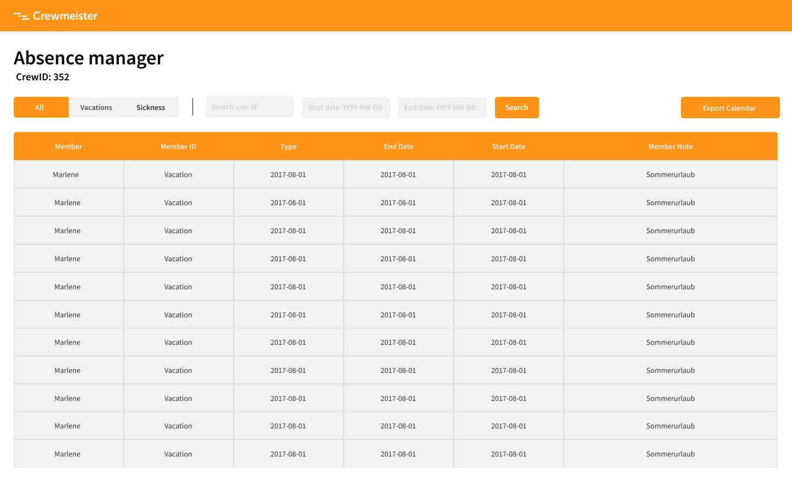

# Web FrontEnd for Absence Manager

The goal when developing this part of the project was to provide a better way to visualize the data return from the API developed in the js_edition folder. The FrontEnd was developed using ReactJS.

### Installation and usage

1. Install yarn (npm will break the lint)

  - https://yarnpkg.com/en/docs/install#mac-stable

2. Install the project dependencies

  - `yarn`

3. Run server developed in js_edition project

4. Run the FrontEnd to consume the server API (will run by default on port 3000)

  - `yarn start`

### Lint

The project lint uses the configuration provided by [eslint-config-crewmeister](https://www.npmjs.com/package/eslint-config-crewmeister) package. To run the linter, just type:

  - `yarn lint`

### Design Prototype

The `FrontEnd Design` was prototyped using `Figma` and can be found in the following link:

  - https://www.figma.com/file/77hM4MAQAFptGWlVztKf5l/Crewmeister-Coding-Challenge?node-id=1%3A3

Here is the design:

Buttons:

  - `Export Calendar` - downloads all absences in .ics file format.
  - `Sickness` - Filters absences by sickness type.
  - `Vacations` - Filters absences by sickness type.
  - `Search` - Filter absences using userId and startDate and endDate input.