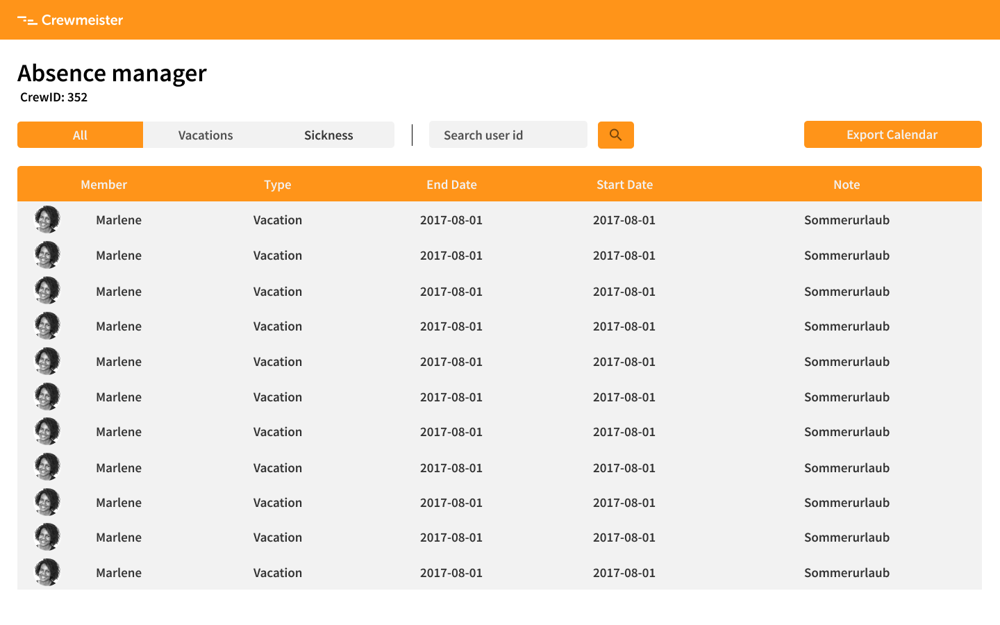

# Prerequisites

1. Install node (v6.5.0 or higher)
2. `npm i`

## Running Specs

`yarn test`

## FrontEnd Design

The `FrontEnd Design` was prototyped using `Figma` and can be found in the following link:

  - https://www.figma.com/file/77hM4MAQAFptGWlVztKf5l/Crewmeister-Coding-Challenge?node-id=1%3A3

Here is the design:

  - It is possible to export the absences in .ics format by clicking on `Export Calendar` button.
  - It is possible to filter absences due to sickness by clicking on `Sickness` button.
  - It is possible to filter absences due to vacation by clicking on `Vacations` button.
  - It is possible to filter absences by user by clicking on `Search` icon and filling the input field.
